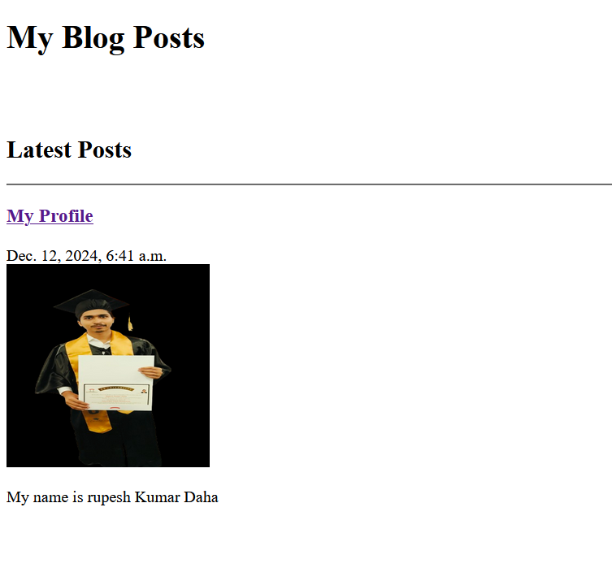

# Basic Django Blog Post Application

## Overview

This is a basic blog post web application built using Django. The application allows users to view blog posts stored in a database. It focuses on core Django functionality without any advanced styling or frontend frameworks.

## Features

- **View All Posts:** Displays a list of all blog posts.
- **Post Details:** Users can click on individual posts to view more details.

## Technologies Used

- **Django:** A high-level Python web framework for rapid development.
- **SQLite:** Default database used for storing blog posts (you can change it to MySQL or any other database as needed).

## Installation

1. Clone the repository:

   ```bash
   https://github.com/daharupesh/Django-Blog-Post.git
   ```

2. Navigate to the project directory:

   ```bash
   cd django-blog-app
   ```

3. Create a virtual environment:

   ```bash
   python -m venv venv
   ```

4. Activate the virtual environment:

   - On Windows:

     ```bash
     venv\Scripts\activate
     ```

   - On macOS/Linux:

     ```bash
     source venv/bin/activate
     ```

5. Install the required packages:

   ```bash
   pip install django
   ```

6. Apply database migrations:

   ```bash
   python manage.py migrate
   ```

7. Run the development server:

   ```bash
   python manage.py runserver
   ```

8. Open your browser and navigate to `http://127.0.0.1:8000/` to view the application.

## Usage

- You can create new blog posts by adding them directly to the database using the Django admin interface or by modifying the database directly.
- All posts will be listed on the homepage.

## Screenshot

Below is a screenshot of the application displaying the blog posts:



